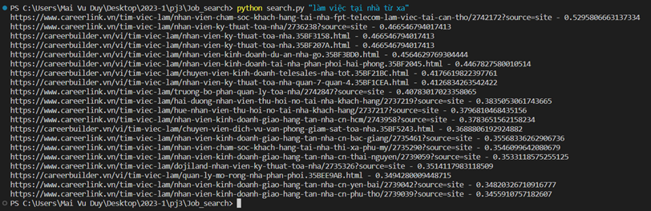
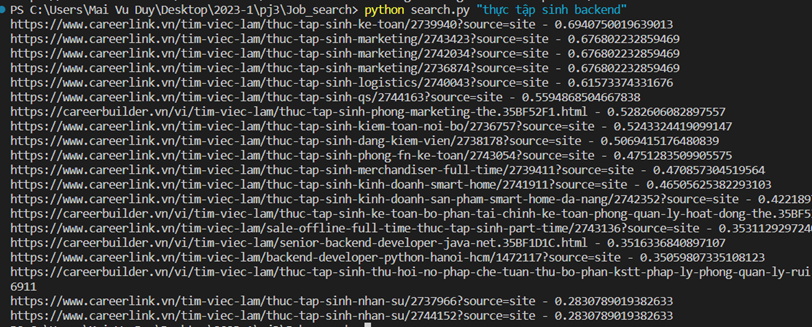

# Job Search

Một ứng dụng đơn giản để tìm kiếm việc làm.

## Hình Ảnh Demo

Thêm các hình ảnh minh họa về sản phẩm của bạn ở đây.




## Cách Sử Dụng

- Chạy file `index.py` để tạo index mới nếu có data mới

    ```bash
    $ python index.py
    ```

- Chạy `search.py` để thực hiện truy vấn tìm kiếm

    ```bash
    $ python search.py "Tìm kiếm của bạn"
    ```

